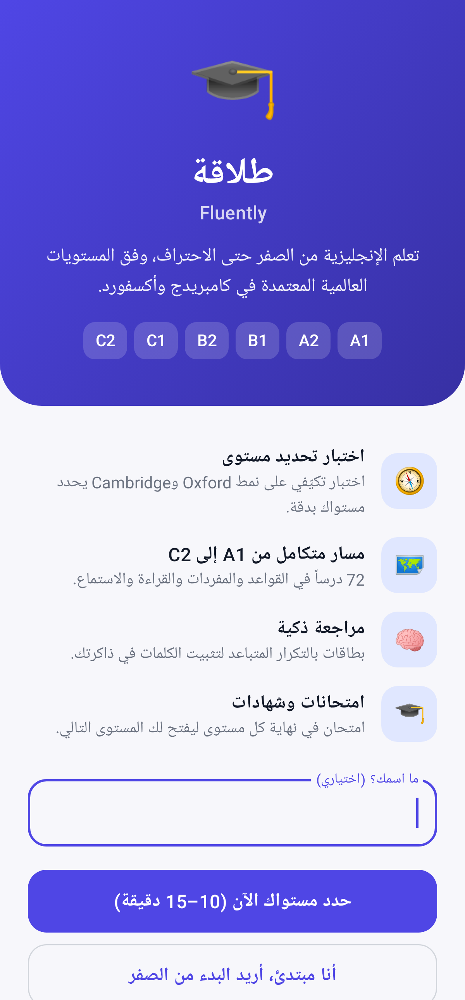
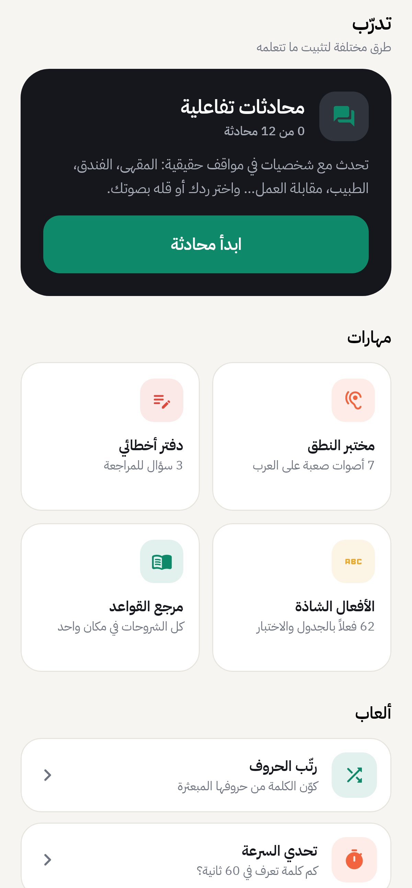
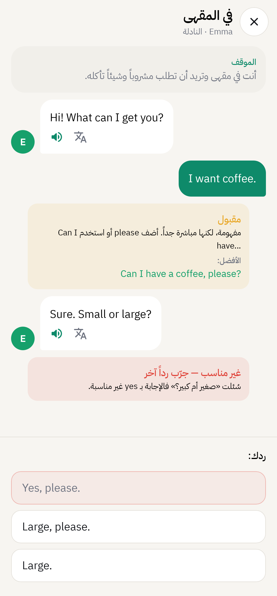
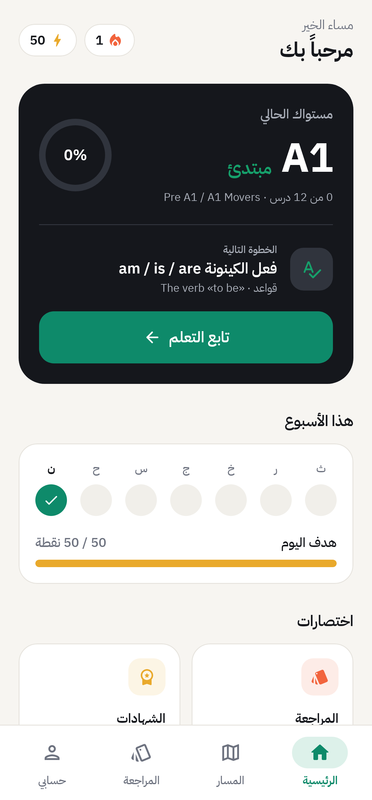
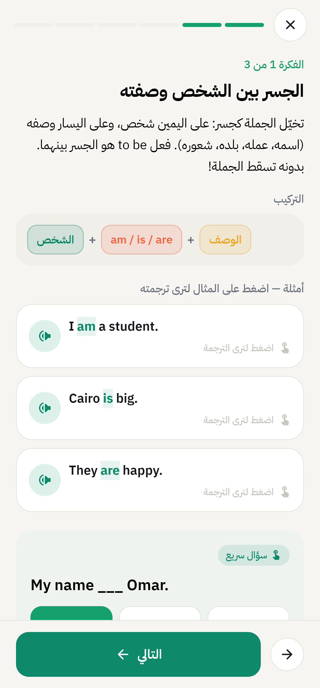
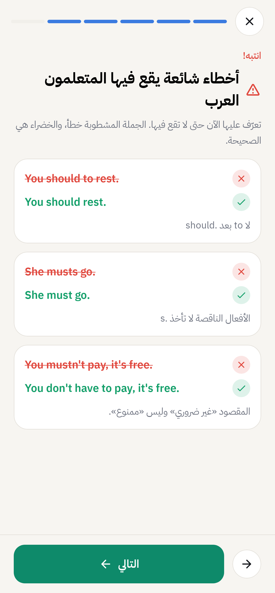
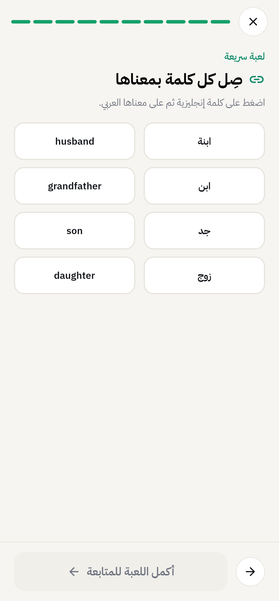
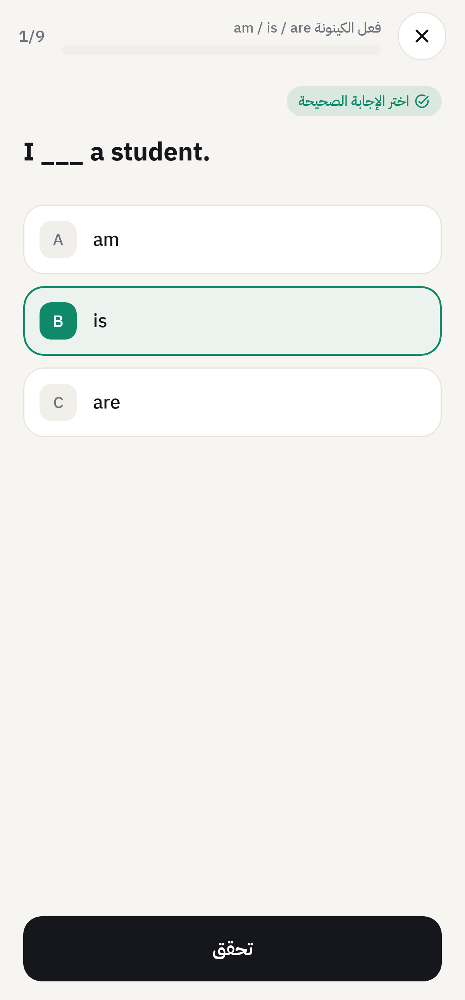

# طلاقة — Fluently 🎓

تطبيق أندرويد متكامل لتعلم اللغة الإنجليزية **من الصفر حتى الاحتراف**، مبني على الإطار الأوروبي المرجعي المشترك للغات (**CEFR: A1 → C2**) — المعيار الذي تعتمده Cambridge وOxford والمجلس الثقافي البريطاني وIELTS وTOEFL.

<p>








</p>

## المزايا

| الميزة | التفاصيل |
|---|---|
| 🧭 **اختبار تحديد مستوى تكيّفي** | على نمط Oxford Placement Test وCambridge English Placement Test وEF SET: أقسام القواعد والمفردات، القراءة، والاستماع. يبدأ من A2 ويصعد أو ينزل حسب إجاباتك (مراحل من 5 أسئلة، ومرحلة إضافية عند النتيجة الحدّية). النتيجة: مستوى CEFR + ما يعادله في Cambridge وIELTS وTOEFL + أداؤك في كل مهارة. |
| 👤 **حساب شخصي** | تسجيل بالاسم والبريد الإلكتروني وكلمة السر في البداية، ويُحفظ تقدّمك في حسابك. مع Firebase يُحفظ على الإنترنت وتجده على أي هاتف (مع استعادة كلمة السر)، وبدونه يُحفظ الحساب على الهاتف بكلمة سر مشفّرة. |
| 📚 **مكتبة قصص متدرّجة** | 20 قصة أصلية من A1 إلى C2: قراءة فقرة بفقرة، «اقرأ معي» بتظليل الجملة المسموعة، تكبير الخط، إضافة الكلمات للبطاقات، ثم أسئلة فهم وتوصيل كلمات وترتيب جملة ونطق، مع سرعة القراءة ولمحة عن الفصل القادم. |
| 🎯 **خطة حسب هدفك** | اختر هدفك (سفر، عمل، دراسة، اختبار دولي، تواصل يومي) فتقترح الصفحة الرئيسية المحادثات والقصص والاختبارات المناسبة. |
| 🏆 **ترتيب المتعلمين** | دوري أسبوعي يبدأ كل اثنين: منصة لأفضل ثلاثة، ترتيبك بين المتعلمين، مع خيار إخفاء اسمك. |
| ✍️ **مختبر الكتابة** | 12 موضوعاً من A1 إلى C2 مع تصحيح فوري مجاني بدون إنترنت: الطول، الفقرات، أدوات الربط، الكلمات المكررة، والأخطاء الشائعة عند العرب (he go، a apple، discuss about…) مع تعليمها داخل النص. يعمل أيضاً في كتابة اختبارات المحاكاة. |
| 📊 **تقرير أسبوعي** | نقاط كل يوم، مقارنة بالأسبوع الماضي، دقتك في كل مهارة (قواعد، مفردات، قراءة، استماع، محادثة، كتابة)، واقتراح لأضعف مهارة. |
| 💾 **نسخة احتياطية** | احفظ تقدّمك في ملف واستعده على أي هاتف. |
| 🗺️ **مسار من 6 مستويات** | 30 وحدة و90 درساً (قواعد، مفردات، قراءة، استماع) — من فعل الكينونة حتى الصيغة الافتراضية والأساليب البلاغية. |
| 🪜 **شرح تفاعلي خطوة بخطوة** | كل درس قواعد عبارة عن شرائح: مقدمة بتشبيه بسيط، أفكار متدرجة مع تركيب ملوّن وجداول، أمثلة مظللة بترجمة مخفية تظهر عند اللمس، سؤال سريع بعد كل فكرة، أخطاء شائعة (خطأ ✗ / صواب ✓)، وحيلة للحفظ. |
| 🔤 **دروس مفردات بطريقة إبداعية** | لكل كلمة حيلة للحفظ (أصل الكلمة، تشابه صوتي، صورة ذهنية)، الكلمات مجمّعة حسب المعنى، قصة قصيرة تستخدم كل الكلمات (اضغط على الكلمة لمعناها وعلى الجملة لسماعها)، أسئلة في سياق، وأخطاء شائعة. |
| 📖 **قراءة واستماع بخطوات احترافية** | قبل النص: سياق وسؤال توقّع وكلمات مفتاحية. أثناءه: استراتيجية (Skimming / Scanning…) ونص تفاعلي بكلمات مظللة. بعده: سؤال الفكرة الرئيسية ومهمة تحدث أو كتابة عن نفسك. |
| 🎮 **تفاعل في كل درس** | بطاقات كلمات تنقلب، لعبة توصيل الكلمات بمعانيها، نصوص قراءة تضغط على أي جملة فيها لتسمعها، واستماع جملةً جملة. |
| 🎤 **تدريب على النطق** | تنطق الكلمة أو الجملة بالميكروفون ويقيّم التطبيق نطقك: عبر خدمة Google في الهاتف إن وُجدت، وإلا بمحرك Vosk مدمج يعمل بدون إنترنت بعد تنزيل حزمة الإنجليزية (40 ميغابايت) مرة واحدة. |
| ✍️ **تمارين متنوعة** | اختيار من متعدد، ترتيب الجمل، الكتابة، التوصيل، النطق، والاستماع مع تصحيح فوري وشرح للخطأ. |
| 💬 **محادثات تفاعلية** | 16 موقفاً حقيقياً من A1 إلى C2 (المقهى، السؤال عن الطريق، المطار، الفندق، حجز مطعم، الطبيب، المرشد الجامعي، مقابلة العمل، التفاوض، الندوات…): الشخصية تتحدث بصوتها، وأنت تختار ردك أو تقوله بالميكروفون، مع ملاحظة تشرح لماذا الرد ممتاز أو مقبول أو غير مناسب. |
| 👂 **مختبر النطق** | 7 أصوات يخلط بينها المتعلمون العرب (p/b، v/f، ship/sheep، pen/pin، th، ch/sh، cat/cut): شرح لطريقة النطق، مقارنة بالصوت، تدريب بالميكروفون، واختبار «أي كلمة سمعت؟». |
| 🎮 **ألعاب تعليمية** | رتّب الحروف، تحدي السرعة (60 ثانية)، والإملاء — بالكلمات التي تعلمتها. |
| 📒 **دفتر الأخطاء** | كل سؤال تخطئ فيه يُحفظ تلقائياً لتراجعه حتى تتقنه. |
| 🔤 **الأفعال الشاذة** | 62 فعلاً مجمّعة حسب النمط مع النطق واختبار. |
| 📚 **مرجع القواعد** | كل الشروحات التفاعلية متاحة في أي وقت. |
| 🎯 **تحدي يومي وكلمة اليوم** | 5 أسئلة يومية مما تعلمته مع مكافأة، وكلمة جديدة كل يوم تضيفها لبطاقاتك. |
| 🔔 **تذكير يومي** | إشعار في الوقت الذي تختاره، فقط في الأيام التي لم تدرس فيها. |
| 🏆 **اختبارات محاكاة دولية** | اختباران لكل من IELTS Academic وCambridge B1 Preliminary وCambridge B2 First (6 اختبارات): نفس الأقسام وأنماط الأسئلة (TRUE/FALSE/NOT GIVEN، إكمال النماذج، Word formation، Key word transformation…)، توقيت لكل قسم، استماع يُعاد مرة واحدة، كتابة بعدّاد كلمات، محادثة يقرأ فيها الممتحن الأسئلة مع بطاقة Part 2 ووقت التحضير. النتيجة Band تقديرية أو Cambridge English Scale مع الدرجة (Grade) ونموذج إجابة. |
| 🎓 **امتحان نهاية كل مستوى** | على غرار امتحانات Cambridge (KET, PET, FCE, CAE, CPE). النجاح بـ 70% يمنحك شهادة المستوى ويفتح المستوى التالي. |
| 🧠 **مراجعة ذكية** | بطاقات كلمات بنظام التكرار المتباعد (صناديق لايتنر: 1، 2، 4، 7، 15، 30 يوماً). |
| 🎧 **نطق واستماع** | صوت إنجليزي من محرك تحويل النص إلى كلام المدمج في أندرويد، مع تشغيل بطيء، والتدرب بطريقة التظليل (Shadowing). |
| 🔥 **تحفيز وتقدم** | نقاط خبرة، هدف يومي، سلسلة أيام، إنجازات، وشهادات. |
| 📺 **إعلانات Unity بلطف** | إعلان بمكافأة اختياري (ضاعف نقاطك، استعد سلسلتك)، إعلان بملء الشاشة بعد كل 3 أنشطة كحد أقصى (وبفاصل 3 دقائق)، وشريط في قائمتي المسار والتدرّب فقط — لا إعلانات أثناء الدروس أو الاختبارات أو النطق. موافقة على الإعلانات المخصصة عند أول استخدام، وخيار تغييرها من «حسابي». |
| 🌙 **تصميم عصري** | Material 3، واجهة عربية من اليمين لليسار، ودعم الوضع الليلي. يعمل بالكامل بدون إنترنت. |

## المنهجية والمصادر

- **CEFR** (مجلس أوروبا) لتقسيم المستويات وأوصاف «ما يستطيع المتعلم فعله».
- **التكرار المتباعد** و**الاستدعاء النشط** لتثبيت المفردات.
- **المدخلات المفهومة** (Stephen Krashen) في نصوص القراءة والاستماع.
- **المنهج التواصلي** (CLT) كما في Headway وEnglish File وCambridge Empower.
- تسلسل القواعد مستوحى من **English Grammar in Use** وقوائم **Oxford 3000/5000** و**English Vocabulary Profile**.

> أسئلة الاختبار والدروس مكتوبة خصيصاً للتطبيق بنفس صيغة ومستوى الاختبارات الدولية، ولا تنسخ مواد محمية بحقوق النشر. معادلات IELTS/TOEFL تقريبية.

## البناء والتشغيل

المتطلبات: JDK 17+ وAndroid SDK 35.

```bash
./gradlew testDebugUnitTest   # اختبارات المحتوى والمنطق
./gradlew assembleDebug       # app/build/outputs/apk/debug/app-debug.apk
```

أو افتح المشروع في Android Studio واضغط Run. كما يبني GitHub Actions ملف الـ APK تلقائياً مع كل دفع (تبويب Actions ← fluently-apk).

> نسخة release موقعة بمفتاح debug لتثبيتها مباشرة؛ استبدله بمفتاحك قبل النشر على Google Play.

## البنية

```
app/src/main/java/com/fluently/english/
├── data/content/     # المنهج (LevelA1..C2)، بنك اختبار المستوى، محرك الاختبار التكيّفي
├── data/progress/    # حفظ التقدم، فتح الدروس والمستويات، التكرار المتباعد
├── tts/              # النطق
└── ui/               # الشاشات (Jetpack Compose) والمكونات والتصميم
```

**التقنيات:** Kotlin · Jetpack Compose · Material 3 · Navigation Compose · Android TextToSpeech.

الخط: [IBM Plex Sans Arabic](https://github.com/IBM/plex) — رخصة SIL Open Font License 1.1.

## تفعيل الحسابات السحابية (Firebase)

بدون إعداد، تعمل الحسابات على الهاتف نفسه. لحفظ التقدّم على الإنترنت:

1. أنشئ مشروعاً مجانياً في [Firebase Console](https://console.firebase.google.com).
2. **Authentication → Sign-in method**: فعّل **Email/Password**.
3. **Firestore Database**: أنشئ قاعدة بيانات، ثم الصق القواعد من `docs/firestore.rules` في تبويب **Rules** (تشمل قواعد الترتيب الأسبوعي).
4. من **Project settings** انسخ **Web API Key** و**Project ID**، وأضفهما إلى `local.properties`:
   ```
   FIREBASE_API_KEY=...
   FIREBASE_PROJECT_ID=...
   ```
   (أو كمتغيرات بيئة / GitHub Secrets بنفس الأسماء)، ثم أعد بناء التطبيق.

## توقيع التطبيق

نسخ الإصدار (Release) تُوقَّع بمفتاح دائم لا يُرفع إلى المستودع. ضع الملف في `signing/fluently-release.jks` وأضف إلى `local.properties`:

```
RELEASE_STORE_FILE=signing/fluently-release.jks
RELEASE_STORE_PASSWORD=...
RELEASE_KEY_ALIAS=fluently
RELEASE_KEY_PASSWORD=...
```

وعلى GitHub Actions: الأسرار `RELEASE_KEYSTORE_BASE64` و`RELEASE_STORE_PASSWORD` و`RELEASE_KEY_ALIAS` و`RELEASE_KEY_PASSWORD`. بدون المفتاح تُوقَّع النسخة بمفتاح التطوير.

## الخصوصية والبيانات

- سياسة الخصوصية: [`docs/PRIVACY_POLICY.md`](docs/PRIVACY_POLICY.md)، وتظهر أيضاً داخل التطبيق (حسابي ← سياسة الخصوصية).
- حذف الحساب وكل بياناته من داخل التطبيق: حسابي ← حذف الحساب نهائياً.
- تقارير الأعطال تُرسل إلى مجموعة `crashes` في Firestore (قواعدها في `docs/firestore.rules`).
